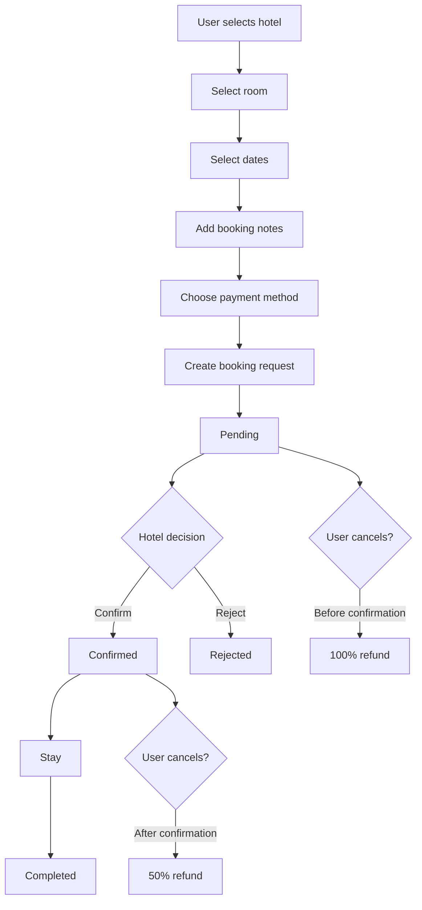
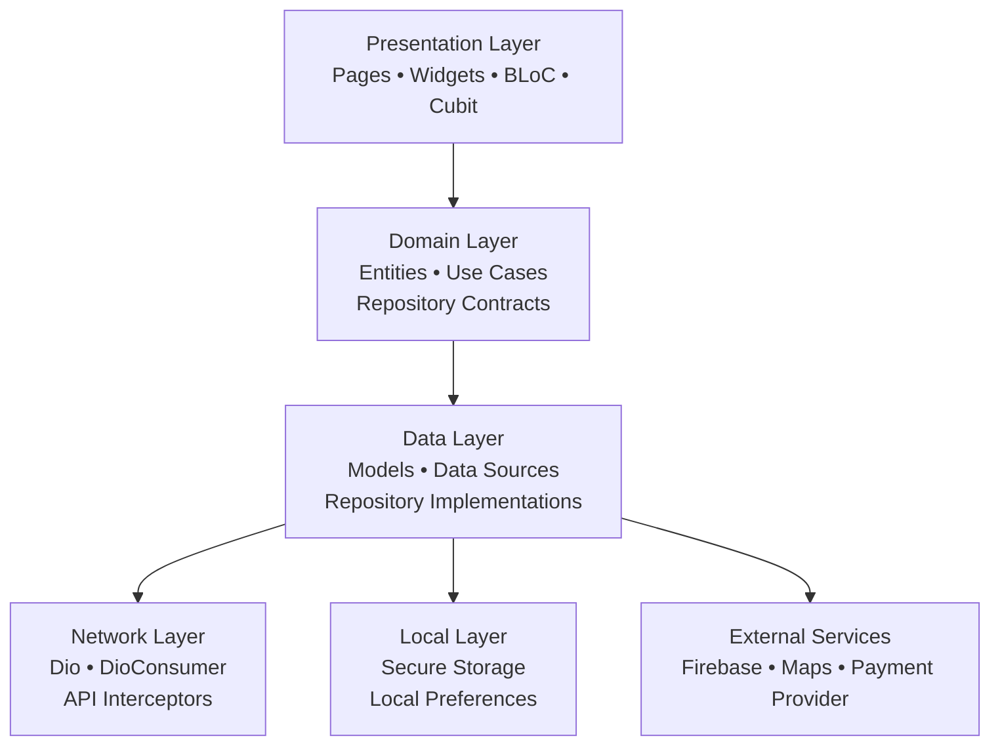
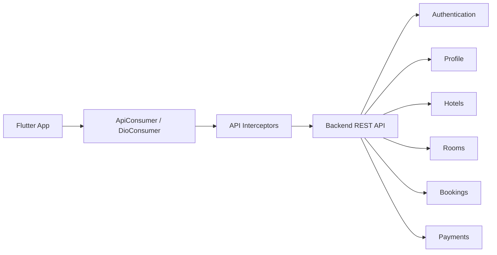
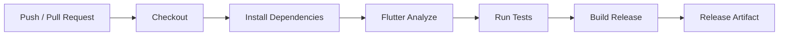
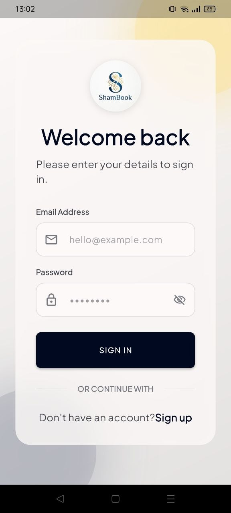
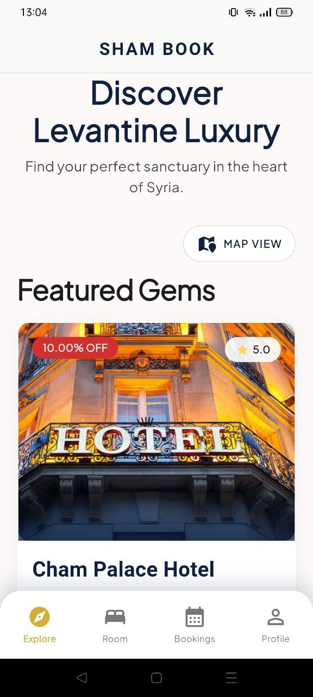
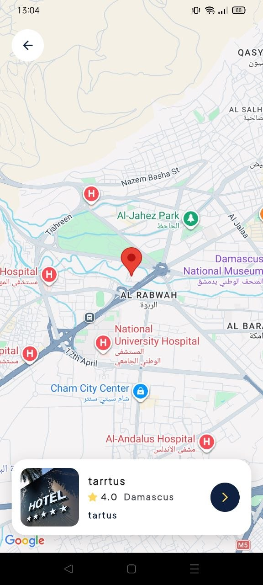
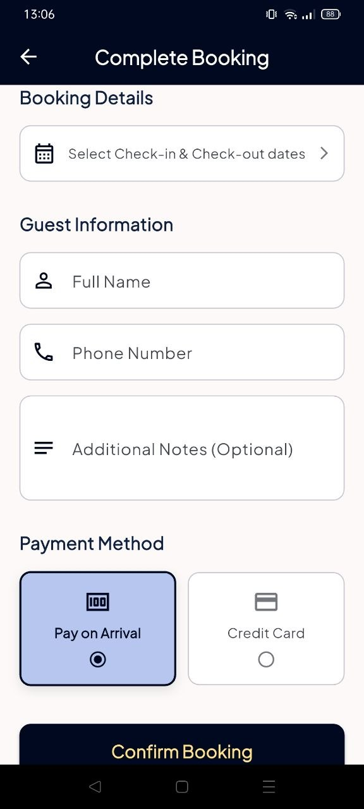
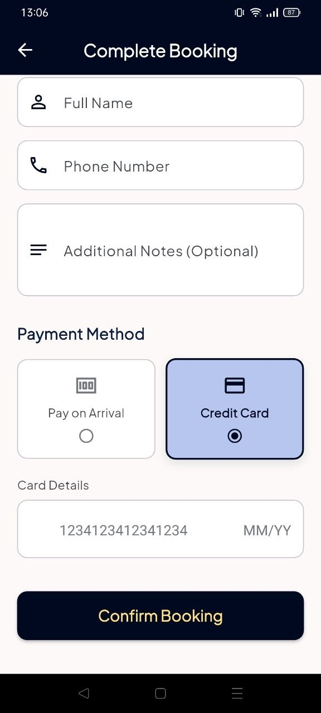
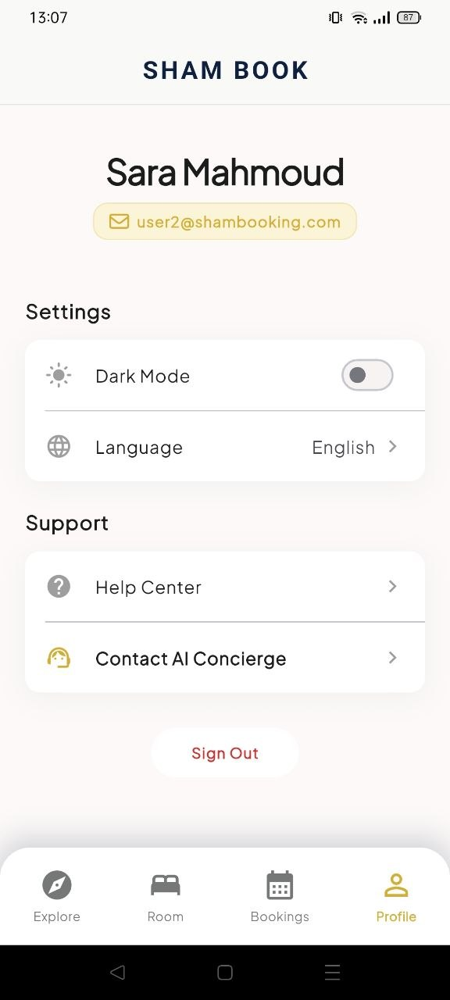

# 🏨 ShamBooking

> **A production-oriented hotel booking and reservation management mobile application built with Flutter.**

ShamBooking is a complete hotel booking platform that allows users to discover hotels and available rooms, view hotel details and locations on a map, choose booking dates, add reservation notes, pay online by card or choose cash on arrival, and manage their reservations throughout the booking lifecycle.

The project is built with a production-oriented architecture using **Flutter, Dart, BLoC, Clean Architecture, Dio, Dependency Injection, Firebase, Secure Storage, Localization, Payment Integration, Flavors, and CI/CD**.

---

## 📱 App Overview

ShamBooking provides an end-to-end hotel reservation experience:

```text
Splash
   ↓
Onboarding
   ↓
Login / Register
   ↓
Email Verification
   ↓
Home
   ↓
Hotels
   ↓
Hotel Details
   ↓
Rooms
   ↓
Select Dates
   ↓
Add Notes
   ↓
Choose Payment
 ┌───────────────┐
 │               │
 ▼               ▼
Card Payment   Cash on Arrival
 │               │
 └───────┬───────┘
         ▼
   Booking Request
         ↓
     Hotel Review
      ↙        ↘
 Confirm       Reject
    ↓
Confirmed
    ↓
Completed
```

---

# ✨ Features

## 🔐 Authentication

- Splash screen
- Onboarding
- User registration
- User login
- Email verification
- Secure access-token storage
- Secure refresh-token storage
- Authentication state handling
- Profile retrieval
- Logout
- Token expiration handling

## 🏨 Hotel Discovery

Users can:

- Browse available hotels
- Browse available rooms
- View hotel images
- View room information
- View hotel details
- View hotel location on a map
- Check room availability based on selected dates
- Start the booking flow from hotel details

## 📅 Booking System

Users can:

- Select a hotel
- Select a room
- Select check-in and check-out dates
- Add booking notes
- Select a payment method
- Submit a booking request
- View booking details
- Track reservation status
- Cancel eligible reservations

---

# 💳 Payment

ShamBooking supports two payment methods.

### Online Card Payment

Users can pay electronically using the configured payment provider.

```text
Flutter App
      │
      ▼
Payment SDK
      │
      ▼
Backend Verification
      │
      ▼
Reservation
```

The mobile application may contain a **publishable/client key**, but secret payment credentials must remain on the backend.

### Cash on Arrival

Users can select:

```text
Cash on Arrival
```

The selected payment method becomes part of the reservation.

> Payment amount validation, payment status, refund calculation, and refund execution should be enforced by the backend.

---

# 🔄 Booking Lifecycle



## Cancellation & Refund Policy

| Reservation State | Result |
|---|---|
| User cancels before hotel confirmation | **100% refund** |
| User cancels after hotel confirmation | **50% refund** |
| Hotel rejects reservation | Backend/payment policy applies |

> Financial decisions must be validated by the backend rather than trusted solely to the mobile client.

---

# 🏗️ Architecture

ShamBooking follows **Clean Architecture** with repository-based data access and BLoC-based state management.



### Presentation Layer

Responsible for:

- UI
- Pages
- Widgets
- BLoC/Cubit
- Navigation
- Loading states
- Success states
- Error states
- User interactions

### Domain Layer

Responsible for:

- Entities
- Use Cases
- Repository contracts
- Business logic

### Data Layer

Responsible for:

- API models
- Remote data sources
- Local data sources
- Repository implementations
- JSON serialization/deserialization

---

# 🔌 API / Backend Architecture

The Flutter application communicates with a backend REST API through a centralized networking layer.



The network layer handles:

- HTTP communication
- Authorization headers
- Access tokens
- Language headers
- Request configuration
- API error handling
- Dio exceptions
- Response parsing

The project uses a centralized `DioConsumer` abstraction and API interceptors instead of coupling each feature directly to HTTP implementation details.

---

# 🧠 State Management

ShamBooking uses **BLoC / Cubit** to manage application state.

Examples of state-driven flows include:

- Authentication
- Profile
- Hotel loading
- Reservation creation
- Reservation management
- Navigation
- Error handling
- Async API operations

The UI reacts to state changes rather than directly implementing business logic.

---

# 💉 Dependency Injection

The project uses **GetIt** for dependency injection.

This keeps the following components loosely coupled:

```text
Data Sources
     ↓
Repositories
     ↓
Use Cases
     ↓
BLoCs / Cubits
     ↓
UI
```

This also improves:

- Testability
- Maintainability
- Separation of concerns
- Scalability

---

# 🌍 Localization

ShamBooking supports localization using `easy_localization`.

Localization is applied to:

- Authentication
- Home
- Hotels
- Rooms
- Booking
- Reservations
- Profile
- Validation messages
- Error messages
- General UI text

Translation keys are centralized so the UI does not depend on hard-coded user-facing strings.

---

# 🗺️ Maps

Hotel details include the hotel's geographical location.

The map experience allows users to:

- View hotel location
- Understand the hotel's position
- Review hotel information before booking

Map/API credentials should be restricted according to the provider's security recommendations.

---

# 🔥 Firebase

Firebase services are integrated into the application infrastructure.

The project uses Firebase-related services such as:

- Firebase Core
- Firebase Cloud Messaging
- Firebase configuration
- Authentication/infrastructure where configured

For production:

- Use the correct production Firebase project
- Verify Android/iOS application identifiers
- Configure SHA fingerprints where required
- Configure push notifications
- Never include Firebase Admin credentials in the mobile application

---

# 🔐 Security

Sensitive information must never be committed to GitHub.

### Never commit

```text
.env
key.properties
*.jks
*.keystore
service-account-private-key.json
Firebase Admin credentials
Payment secret keys
Backend private keys
CI/CD signing credentials
Access tokens
Refresh tokens
```

### Client vs Secret Credentials

```text
Publishable / Client Key
        ↓
Mobile Application

Secret Key
        ↓
Backend / CI/CD only
```

Examples:

- Payment publishable key → client-side
- Payment secret key → backend-only
- Maps client key → mobile, with restrictions
- Firebase platform configuration → client-side where appropriate
- Firebase Admin credentials → backend-only
- Signing credentials → CI/CD secrets

> A client key being visible in a mobile application does not automatically make it a secret. It should still be restricted according to the provider's security model.

---

# 🌱 Development & Production Flavors

ShamBooking supports separate environments such as:

```text
Development
Production
```

The project uses separate entry points:

```text
lib/main_dev.dart
lib/main_prod.dart
```

The production environment must use:

- Production API
- Production Firebase configuration
- Production payment configuration
- Production signing
- Production application identifiers

Development credentials and endpoints must never accidentally be used in a production release.

---

# ⚙️ CI/CD

The project includes CI/CD automation for quality checks and release workflows.

Typical pipeline:



Typical checks:

```bash
flutter pub get
flutter analyze
flutter test
```

Production artifacts can include:

```text
Android APK
Android AAB
iOS IPA
```

# 🧰 Tech Stack

| Technology | Purpose |
|---|---|
| Flutter | Cross-platform mobile development |
| Dart | Programming language |
| BLoC / Cubit | State management |
| Clean Architecture | Application architecture |
| Dio | HTTP networking |
| GetIt | Dependency injection |
| Dartz | Functional error handling |
| Equatable | Value equality |
| Firebase | Application infrastructure |
| Firebase Messaging | Push notifications |
| Flutter Secure Storage | Secure token storage |
| Easy Localization | Localization |
| Google Maps / Maps SDK | Hotel locations |
| Payment SDK | Online card payments |
| GoRouter | Navigation |
| GetStorage | Local non-sensitive storage |
| Flutter ScreenUtil | Responsive UI |

---

# 📸 Screenshots

| Onboarding | Login | Home |
|---|---|---|
|  |  |  |

| Hotel Details | Map | Room Details |
|---|---|---|
|  |  |  |

| Booking | Payment | Profile |
|---|---|---|
|  |  |  |

---

# 🎬 Booking Flow GIF


---

# 📁 Project Structure

Based on the ShamBooking architecture and code structure established during development:

```text
lib/
├── core/
│   ├── api/
│   ├── bootstrap/
│   ├── config/
│   ├── constant/
│   ├── error/
│   ├── helpers/
│   ├── theme/
│   └── widgets/
│
├── features/
│   ├── auth/
│   │   ├── data/
│   │   │   ├── datasources/
│   │   │   ├── models/
│   │   │   └── repositories/
│   │   │
│   │   ├── domain/
│   │   │   ├── entities/
│   │   │   ├── repositories/
│   │   │   └── usecases/
│   │   │
│   │   └── presentation/
│   │       ├── bloc/
│   │       ├── pages/
│   │       └── widgets/
│   │
│   ├── hotel/
│   ├── rooms/
│   ├── bookings/
│   ├── profile/
│   ├── home/
│   ├── splash/
│   └── onboarding/
│
├── injection_container.dart
├── app.dart
├── main_dev.dart
└── main_prod.dart
```

---

# 🚀 Getting Started

## Prerequisites

Install:

- Flutter SDK
- Dart SDK
- Android Studio / VS Code
- Android SDK
- Xcode for iOS
- A configured backend
- Firebase configuration
- Required Maps configuration
- Required payment configuration

Check your environment:

```bash
flutter doctor
```

## Installation

```bash
git clone https://github.com/ahmadhomsy/sham-booking.git
cd sham_booking
flutter pub get
```

Development:

```bash
flutter run -t lib/main_dev.dart
```

Production:

```bash
flutter run -t lib/main_prod.dart
```

---

# 🧪 Testing

Run static analysis:

```bash
flutter analyze
```

Run tests:

```bash
flutter test
```

Integration tests, when configured:

```bash
flutter test integration_test
```

---

# 📦 Android Release

## APK

```bash
flutter build apk --release -t lib/main_prod.dart
```

## Split APKs

```bash
flutter build apk --release --split-per-abi -t lib/main_prod.dart
```

Possible architectures:

```text
armeabi-v7a
arm64-v8a
x86_64
```

## Google Play AAB

```bash
flutter build appbundle --release -t lib/main_prod.dart
```

The Android App Bundle is the preferred release format for Google Play.

---

# 🍎 iOS Release

```bash
flutter build ipa --release
```

Before App Store submission verify:

- Bundle Identifier
- Apple Developer Team
- Distribution signing
- Provisioning
- Push Notifications
- Firebase setup
- Production API
- Payment configuration
- App Privacy information

---

# 📄 Legal

A production release should provide the appropriate:

- Privacy Policy
- Terms of Service
- Booking Terms
- Cancellation Policy
- Refund Policy
- Payment Terms
- Account Deletion Policy
- Support information

---

# 👥 Contributors

## Project Maintainer

**Ahmad Ibrahim AlHomsi**

### Responsibilities

- Flutter application development
- Clean Architecture
- BLoC/Cubit state management
- API integration
- Authentication
- Hotel and room booking flow
- Payment integration
- Localization
- Firebase integration
- CI/CD
- Production release preparation

### Abd AlRazzaq Mujahid
**Backend Developer**

Responsibilities:

- Backend development using **Node.js**
- Backend architecture using **NestJS**
- REST API development
- Authentication and authorization
- Hotel and room management APIs
- Booking and reservation management
- Payment-related backend integration
- Cancellation and refund business logic
- Database and backend business logic
- API validation and error handling

---

### 👥 Team

ShamBooking was developed as a collaborative **Flutter + Backend** project:

```text
Flutter Mobile Application
        │
        │ REST API
        ▼
Node.js / NestJS Backend

---


# 📜 License

**Proprietary License**

```text
Copyright © 2026 ShamBooking.

All rights reserved.

This project and its source code are proprietary.
No part of this project may be copied, modified,
distributed, or used commercially without explicit
permission from the copyright holder.
```

# ⭐ Project Summary

ShamBooking is a complete Flutter hotel booking system that combines:

- 🏨 Hotel discovery
- 🛏️ Room availability
- 📅 Date-based booking
- 💳 Online card payment
- 💵 Cash on arrival
- 🔄 Reservation lifecycle
- ❌ Cancellation and refund rules
- 🏨 Hotel confirmation/rejection
- 🗺️ Hotel map locations
- ✉️ Email verification
- 🔔 Push notifications
- 🌍 Localization
- 🔐 Secure authentication
- 🏗️ Clean Architecture
- 🧠 BLoC state management
- 💉 Dependency Injection
- 🔌 Dio API integration
- 🔥 Firebase
- 🌱 Development / Production flavors
- ⚙️ CI/CD
- 📦 Android & iOS release workflows

---
